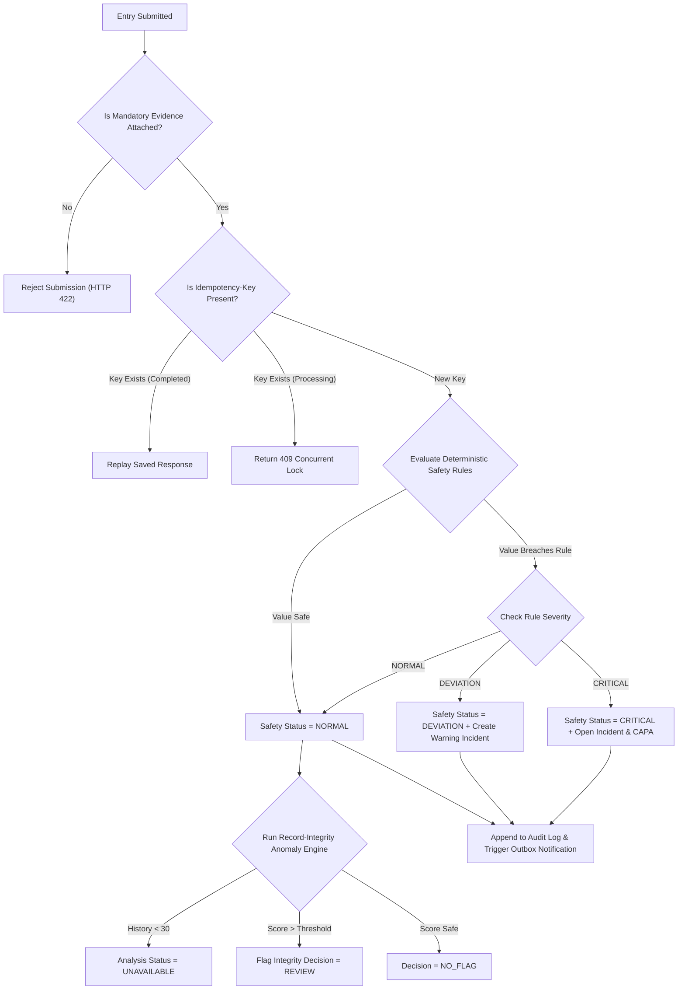

# App Flow & Navigation Specifications (APP_FLOW.md) — Bharat FoodSafe

**App Name:** Bharat FoodSafe  
**Specification Version:** 1.5.0  
**Document Status:** Build-Locked Specification  
**App Description:** Mobile-first operational food-safety assurance platform for Indian restaurants, cloud kitchens, canteens, and caterers. Converts food safety rules and SOPs into versioned recurring tasks, captures verified digital photo/numerical evidence, performs deterministic safety rule evaluations, flags statistical record-integrity anomalies, manages incidents/CAPA, and maintains a cryptographically verified audit hash chain.

---

## 1. Entry Points

Users access the Bharat FoodSafe platform through five defined entry vectors depending on their role and operational context:

1. **Staff Mobile PWA Bookmark / Home Screen Icon:** Direct launch into `/login` or automatically restored session to `/staff/dashboard`.
2. **Kitchen Outlet QR Code Scan:** Staff scans a physical QR sticker on equipment (e.g., Chiller #1) $\rightarrow$ deep links to `/staff/tasks?equipment_id=<uuid>` or direct task execution `/staff/tasks/<task_id>`.
3. **Manager Desktop Browser Bookmark:** Access to `/login` $\rightarrow$ authenticates via Phone + PIN $\rightarrow$ redirects to `/manager/dashboard`.
4. **Platform Admin Portal URL:** Access to `/login` $\rightarrow$ authenticates via Email + Password $\rightarrow$ redirects to `/admin/dashboard`.
5. **Public / Dining Customer Shared Link:** Public user clicks a shared link or QR code on a restaurant menu $\rightarrow$ lands directly on `/businesses/<restaurant_id>` (Read-only public business profile, Phase 3).

---

## 2. Core User Flows

### Flow 1: Staff Authentication & Session Setup
**Context:** Staff member logging in on a shared or personal mobile device at the start of a kitchen shift.

#### Happy Path:
1. **Page:** Login (`/login`)
2. **Elements:** Tab Selector (`Staff / Manager` vs `Platform Admin`), Phone Input field, PIN Input field (4-6 digits), "Sign In" Button.
3. **User Action:** Selects `Staff / Manager` tab, enters registered phone number (`9876543210`) and 4-digit PIN (`1234`), taps **Sign In**.
4. **System Response:** 
   - Client validates phone/PIN format.
   - Sends `POST /api/v1/auth/login` payload `{ "phone": "9876543210", "pin": "1234" }`.
   - Server authenticates credentials, resolves active role (`Staff`), resolves `TenantContext` (`restaurant_id`), issues JWT Access Token (15m TTL) and Refresh Token (7d TTL, persisted as SHA-256 hash in `auth_sessions`).
   - App stores Access Token in memory and sets Refresh Token in secure HTTP-only cookie or encrypted local storage.
5. **Next Step:** Navigates immediately to Staff Dashboard (`/staff/dashboard`).

#### Error States:
- **E1.1 Invalid Format:** Phone $< 10$ digits or PIN $< 4$ digits.
  - *UI Display:* Red inline field error below input: `"Please enter a valid 10-digit phone number and 4-6 digit PIN."`
  - *User Action:* Corrects input numbers.
- **E1.2 Bad Credentials (401 Unauthorized):** Incorrect PIN.
  - *UI Display:* Global alert banner: `"Invalid phone number or PIN. Please try again."`
  - *System Action:* Increments failed attempt counter; logs security audit event `AUTH_LOGIN_FAILED`.
- **E1.3 Suspended Account (403 Forbidden):** User account status is `SUSPENDED` or `DISABLED`.
  - *UI Display:* Modal dialog: `"Your account has been suspended. Please contact your restaurant manager."`
- **E1.4 Rate Limited (429 Too Many Requests):** More than 5 failed attempts in 1 minute.
  - *UI Display:* Toast alert: `"Too many login attempts. Please wait 60 seconds before trying again."`

#### Edge Cases:
- **Abandonment:** User leaves tab halfway through entering PIN $\rightarrow$ Form input resets after 5 minutes of inactivity.
- **Session Expiry:** Access token expires after 15 minutes $\rightarrow$ Axios/Fetch interceptor sends background `POST /api/v1/auth/refresh`. If refresh session is valid, issues new access token seamlessly without UI disruption.
- **Token Reuse Attack:** Stolen refresh token attempted after revocation $\rightarrow$ Server revokes entire `token_family_id`, logs security alert `SYSTEM_SECURITY_EVENT`, and forces all devices for that user to re-authenticate at `/login`.

---

### Flow 2: Staff Task Execution & Presigned Evidence Submission
**Context:** Kitchen staff performing a daily temperature task and capturing digital photo evidence.

#### Happy Path:
1. **Page:** Task Execution (`/staff/tasks/:id`)
2. **Elements:** Task Title (`Morning Chiller #1 Temperature`), Target SOP Instruction (`Must be <= 4.0 °C`), Equipment Tag (`Chiller #1`), Numeric Input (`Value`), Unit Dropdown (`°C`), Evidence Upload Box, "Submit Check" Button.
3. **User Action:** Staff taps **Start Task** (triggers `POST /api/v1/tasks/:id/start`), enters `3.5` into numeric value, taps **Attach Photo Evidence**, captures photo using camera.
4. **System Response:** 
   - Step 4a: Client requests presigned URL via `POST /api/v1/uploads/presign` with payload `{ "purpose": "ENTRY_EVIDENCE", "filename": "chiller1.jpg", "mime_type": "image/jpeg", "size_bytes": 1048576 }`. Server returns `evidence_file_id` and presigned S3 upload URL.
   - Step 4b: Client uploads binary image directly to S3/Local Storage target via `PUT`.
   - Step 4c: Client calls `POST /api/v1/uploads/:id/confirm`. Server inspects magic bytes, SHA-256 hash, size, and MIME type, marking upload `AVAILABLE`.
   - Step 4d: Client submits task entry via `POST /api/v1/tasks/:id/entries` with header `Idempotency-Key: <uuid>` and payload `{ "value_numeric": 3.5, "unit": "C", "equipment_id": "<uuid>", "evidence_file_id": "<uuid>" }`.
   - Step 4e: Server evaluates deterministic Safety Rules Engine $\rightarrow$ Safety status `NORMAL`. Runs Record-Integrity Anomaly Engine $\rightarrow$ Integrity decision `NO_FLAG`. Updates audit hash chain in DB transaction.
5. **Next Step:** Displays Success Modal with green checkmark (`"Task Submitted & Verified Successfully!"`) and redirects to `/staff/tasks` after 1.5s.

#### Error States:
- **E2.1 Missing Required Evidence (422 Unprocessable Entity):** Task template requires evidence, but user submits without completing upload.
  - *UI Display:* Inline error below Upload Box: `"Photo evidence is required for this temperature check."`
  - *User Action:* User captures and uploads photo before resubmitting.
- **E2.2 Invalid File Upload (400 Bad Request):** User uploads non-image file (e.g. `.pdf` or executable script).
  - *UI Display:* Error toast: `"Invalid file type. Only JPEG, PNG, and WebP images up to 10MB are permitted."`
- **E2.3 Idempotency Replay (200 OK / Cached):** Network drops after server processes write, client retries exact request with same `Idempotency-Key`.
  - *System Action:* Server detects `COMPLETED` key in `idempotency_keys` table and replays original response without duplicate entry or audit creation.
- **E2.4 Idempotency Key Reuse Conflict (409 Conflict):** Same key sent with a different canonical payload.
  - *UI Display:* Error modal: `"Idempotency key reuse detected with modified payload. Please refresh and try again."`

#### Edge Cases:
- **Going Back / Unsaved Progress:** Staff taps Back arrow after taking photo but before submitting $\rightarrow$ Browser confirm dialog: `"You have unsaved entry data. Are you sure you want to leave?"`
- **Task Overdue During Execution:** Task reaches due time while staff is taking photo $\rightarrow$ Server updates task state to `OVERDUE`. Entry submission is still accepted, but entry is flagged `SUBMITTED_LATE`.

---

### Flow 3: Critical Deviation & Manager Incident CAPA Resolution
**Context:** Staff logs a critical out-of-range temperature; Manager handles automated incident and verifies corrective action.

#### Happy Path:
1. **Page:** Staff Task Execution (`/staff/tasks/:id`) $\rightarrow$ Manager Incident Queue (`/manager/incidents`)
2. **User Action (Staff):** Staff logs Freezer #2 temperature as `2.8` °C (Required: $\le -18.0$ °C) with photo evidence and submits.
3. **System Response (Backend):**
   - Rules Engine evaluates $2.8 > -18.0 \rightarrow$ Safety Status `CRITICAL`.
   - System automatically creates an `OPEN` Incident and an `OPEN` Corrective Action (CAPA).
   - Writes transactional outbox notification $\rightarrow$ Manager receives immediate in-app/push notification: *"CRITICAL DEVIATION: Freezer #2 logged at 2.8°C"*.
4. **User Action (Manager):** Manager taps notification $\rightarrow$ opens `/manager/incidents/:id` $\rightarrow$ taps **Start Incident Work** (`POST /api/v1/incidents/:id/start`) $\rightarrow$ assigns CAPA to Staff (`POST /api/v1/corrective-actions/:id/start`).
5. **User Action (Staff Re-check):** Staff receives CAPA assignment, transfers stock to backup unit, repairs gasket, takes re-check reading (`-19.5` °C), attaches evidence, and taps **Complete Action** (`POST /api/v1/corrective-actions/:id/complete`).
6. **User Action (Manager Verification):** Manager reviews re-check evidence on `/manager/corrective-actions/:id` and taps **Verify Resolution** (`POST /api/v1/corrective-actions/:id/verify`).
7. **Next Step:** Incident transitions `VERIFICATION_PENDING` $\rightarrow$ `CLOSED`. Incident timeline updates with full green audit badge.

#### Error States:
- **E3.1 Attempted Direct Status Patch (409 Conflict):** Manager attempts to call generic `PATCH /api/v1/incidents/:id` setting `status: CLOSED` without verification.
  - *UI Display:* Red error alert: `"Direct status updates are prohibited. Incidents must be closed via verified CAPA re-check."`
- **E3.2 Re-Check Evaluation Still Critical (422 Unprocessable Entity):** Staff submits re-check value `1.0` °C (still above $-18.0$ °C).
  - *UI Display:* Error toast: `"Re-check value is still in CRITICAL deviation range. Action cannot be completed."`
  - *System Action:* CAPA status reverts to `REOPENED`.

#### Edge Cases:
- **Manager Reopens Resolved CAPA:** Manager inspects re-check photo and finds it blurry $\rightarrow$ taps **Reopen CAPA** (`POST /api/v1/corrective-actions/:id/reopen`) with note *"Photo illegible, please upload clear picture of thermometer digital display."* $\rightarrow$ CAPA status returns to `IN_PROGRESS`.

---

### Flow 4: Manager Anomaly Review & Escalation
**Context:** Manager reviews statistical record-integrity flags raised by the Anomaly Engine.

#### Happy Path:
1. **Page:** Anomaly Review Queue (`/manager/anomalies` or `/admin/anomalies`)
2. **Elements:** Anomaly Table, Risk Level Badges (`HIGH` / `MEDIUM`), Anomaly Feature Reasons, Action Buttons (**Dismiss Signal**, **Escalate to Incident**).
3. **User Action:** Manager clicks on an anomaly item flagged with Decision `REVIEW`, Risk Level `HIGH` (Reason: *"Unusual burst submission: 20 tasks in 42s with zero variance"*).
4. **Manager Review:** Inspects timestamps and entry values, determines staff filled forms without visiting kitchen area.
5. **User Action:** Clicks **Escalate to Incident** (`POST /api/v1/anomalies/:id/escalate`) with note *"Staff instructed on real-time logging policy"*.
6. **System Response:** System opens an internal `REVIEW` Incident linked to the entry cluster and updates anomaly status to `ESCALATED`. Logs manager decision to `audit_log`.
7. **Next Step:** Item removed from active Anomaly Review Queue and archived in Audit History.

#### Error States:
- **E4.1 Model Unavailable (200 OK / Degradation):** ML engine service unavailable during submission.
  - *System Action:* Server sets `analysis_status = UNAVAILABLE` on `anomaly_results`. Deterministic safety rules remain unaffected.
  - *UI Display:* Gray info badge in entry detail: `"Integrity Analysis: Unavailable (Insufficient History or Model Offline)"`.

---

## 3. Navigation Map (Hierarchical Screen Tree)

```
Root (/)
├── /login [Public Access]
├── /customer/register [Public Access - Phase 3]
│
├── /staff (Staff Layout Shell) [Protected: role=Staff]
│   ├── /staff/dashboard (Today's Workload & Shift Summary)
│   ├── /staff/tasks (Assigned Task Queue)
│   │   └── /staff/tasks/:id (Task Execution & Evidence Submission)
│   ├── /staff/history (Submitted Entry History & Safety Status)
│   └── /staff/notifications (In-App Alerts)
│
├── /manager (Manager Layout Shell) [Protected: role=Manager]
│   ├── /manager/dashboard (Operational Overview & KPI Cards)
│   ├── /manager/tasks (Outlet Task Monitoring & Reassignment)
│   ├── /manager/equipment (Equipment Master Management)
│   ├── /manager/incidents (Incident Exception Queue & Timeline)
│   │   └── /manager/incidents/:id (Incident Detail & Re-check)
│   ├── /manager/corrective-actions (CAPA Management & Verification)
│   ├── /manager/suppliers (Suppliers, Products & Batch Receiving)
│   ├── /manager/verification (Business Verification Document Upload)
│   ├── /manager/audit (Outlet Append-Only Audit History)
│   └── /manager/reports (Inspection-Readiness Reports & PDF/CSV Export)
│
├── /admin (Platform Admin Shell) [Protected: role=Platform Admin]
│   ├── /admin/dashboard (Platform Global Overview)
│   ├── /admin/restaurants (Restaurant Outlet Management)
│   ├── /admin/users (User Accounts & Role Assignments)
│   ├── /admin/roles (Custom RBAC Role & Permission Config)
│   ├── /admin/task-categories (Task Category Master)
│   ├── /admin/task-templates (Template Version Master)
│   ├── /admin/rule-sources (Verified Rule Source Catalogue)
│   ├── /admin/safety-rules (Safety Rule Configurations & Bindings)
│   ├── /admin/verifications (Business Verification Review Queue)
│   ├── /admin/anomalies (Platform Record-Integrity Review Queue)
│   ├── /admin/official-records (Official Record Management)
│   ├── /admin/public-profile (Public Transparency Profile Settings)
│   └── /admin/audit (Global Platform Audit Log)
│
└── /businesses [Public / Unauthenticated]
    ├── /businesses (Browse Verified Public Food Businesses)
    └── /businesses/:id (Public Business Transparency Profile)
```

---

## 4. Screen Inventory

| Route | Access Level | Screen Purpose | Key UI Elements | User Actions $\rightarrow$ Target Route | State Variants |
| :--- | :--- | :--- | :--- | :--- | :--- |
| `/login` | Public | User authentication | Role toggle, Phone/Email inputs, PIN/Password inputs, Sign In button | Submit $\rightarrow$ `/staff/dashboard` or `/manager/dashboard` or `/admin/dashboard` | Normal, Loading, Error (Bad creds, Rate limit) |
| `/staff/dashboard` | Staff | Today's shift task overview | Progress ring, Pending tasks card, Urgent alerts, Quick Start button | Click Task $\rightarrow$ `/staff/tasks/:id` | Normal, Loading, Empty (All tasks complete!) |
| `/staff/tasks` | Staff | Filterable list of assigned tasks | Category tabs (`All`, `Temperature`, `Hygiene`), Search, Status badges | Click Card $\rightarrow$ `/staff/tasks/:id` | Normal, Loading, Empty |
| `/staff/tasks/:id` | Staff | Task execution & evidence capture | Task SOP text, Equipment tag, Value input, Photo Uploader, Submit button | Submit Entry $\rightarrow$ Success modal $\rightarrow$ `/staff/tasks` | Normal, Uploading, Validating, Error |
| `/manager/dashboard` | Manager | Operational KPI summary | Compliance score card, Overdue counter, Active Incidents card, Trend chart | Click Incident $\rightarrow$ `/manager/incidents`, Click Report $\rightarrow$ `/manager/reports` | Normal, Loading, Error |
| `/manager/incidents` | Manager | Exception management queue | Filter tabs (`Open`, `In Progress`, `Verification Pending`), Severity badges | Click Item $\rightarrow$ `/manager/incidents/:id` | Normal, Loading, Empty (Zero active incidents) |
| `/manager/incidents/:id` | Manager | Incident detail & CAPA timeline | Audit timeline, Initial entry evidence, CAPA action form, Re-check status | Start Work $\rightarrow$ In Progress, Verify $\rightarrow$ Closed | Normal, Processing, Error |
| `/manager/reports` | Manager | Audit readiness & report export | Date picker, Report type selector, Download PDF/CSV buttons | Download $\rightarrow$ Triggers file download | Normal, Exporting, Error |
| `/admin/rule-sources` | Admin | FSSAI regulatory source catalogue | Source table, Authority tag, Document type, Verification status badge | Add Source $\rightarrow$ Modal, Verify Source $\rightarrow$ `VERIFIED` | Normal, Loading, Empty |
| `/businesses/:id` | Public | Public compliance profile | Restaurant info, Verification badge, Compliance rating, Non-certification disclaimer | Follow Business $\rightarrow$ Prompt login if unauthenticated | Normal, Loading, 404 Not Found |

---

## 5. IF-THEN Decision Logic Matrix



### Detailed Rules Matrix:
1. **IF** `task_template_version.requires_evidence == True` **AND** `evidence_file_id == Null` $\rightarrow$ **THEN** reject entry with HTTP `422 Unprocessable Entity` ("Evidence required").
2. **IF** `rule_source.review_status != 'VERIFIED'` $\rightarrow$ **THEN** safety rule derived from this source CANNOT be activated (`HTTP 400`).
3. **IF** `entry_safety_evaluations.result == 'CRITICAL'` $\rightarrow$ **THEN** system MUST automatically instantiate `incidents` row (`status = OPEN`, `severity = CRITICAL`) AND `corrective_actions` row (`status = OPEN`).
4. **IF** `user.status == 'SUSPENDED'` OR `user.status == 'DISABLED'` $\rightarrow$ **THEN** reject token refresh and API access with HTTP `403 Forbidden`.
5. **IF** `idempotency_keys.key` matches existing record for user **AND** `request_hash` matches $\rightarrow$ **THEN** return stored `response_jsonb` immediately without executing domain logic.
6. **IF** `idempotency_keys.key` matches existing record **BUT** `request_hash` differs $\rightarrow$ **THEN** return HTTP `409 Conflict` (`IDEMPOTENCY_KEY_REUSE`).
7. **IF** Anomaly Isolation Forest inference fails/times out $\rightarrow$ **THEN** set `anomaly_results.analysis_status = UNAVAILABLE`; DO NOT alter deterministic safety status.

---

## 6. Global Error Handling & Edge Cases

### 6.1 Standardized API Error Response Structure
All application APIs return errors in a canonical envelope format:

```json
{
  "success": false,
  "error": {
    "code": "TASK_STATE_CONFLICT",
    "message": "The task cannot be completed from its current state.",
    "details": [
      {
        "field": "status",
        "issue": "Task status is OVERDUE and requires manager extension."
      }
    ]
  },
  "meta": {
    "request_id": "c7a8b9d0-1234-5678-9abc-def012345678"
  }
}
```

### 6.2 Major System Error Handlers

#### 1. HTTP 404 Not Found (Invalid Route or Missing Entity)
- **UI Display:** Full-page `EmptyState` component with graphic illustration, title: *"Page or Record Not Found"*, message: *"The requested resource does not exist or you do not have permission to view it."*
- **User Actions:** "Go to Dashboard" button (redirects to role-appropriate home route) or "Go Back" button.
- **Recovery:** Client clears stale parameters from URL state.

#### 2. HTTP 500 Internal Server Error (Uncaught Exception)
- **UI Display:** `ErrorState` component banner, title: *"System Error Occurred"*, message: *"An unexpected server error occurred. Our team has been notified. Request ID: c7a8b9d0..."*
- **User Actions:** "Try Again" button (retries request with exponential backoff) or "Report Issue" button.
- **System Recovery:** Error logged to structured logger with full stack trace and `request_id`; database transaction safely rolled back.

#### 3. Network Offline / Connection Loss
- **UI Display:** Persistent top banner alert (Yellow/Black): *"⚡ Offline Mode — Internet connection lost. Reconnecting..."*
- **Client Behavior:** Form submit buttons show loading spinner and disable repeated taps. Pending write operations queue locally for automatic retry upon network restoration.
- **Recovery:** Web browser `online` event listener triggers automatic re-validation of active session.

---

## 7. Responsive & Device-Specific Behavior

| Feature / Screen | Mobile View (< 768px) — Staff Primary | Desktop View ($\ge 1024$px) — Manager/Admin Primary |
| :--- | :--- | :--- |
| **Navigation** | Bottom navigation bar (`Tasks`, `History`, `Notifications`, `Profile`) | Left sticky sidebar menu with collapsible section groups |
| **Staff Task Execution** | Fullscreen single-column step wizard; native camera interface launched for photo capture | Center modal overlay; drag-and-drop file uploader zone |
| **Manager Dashboards** | Stacked KPI cards; horizontal scrollable summary tables | Multi-column grid dashboard; interactive trend charts & side-by-side incident timeline |
| **Tables & Lists** | Card-based list layout with status badges and touch action buttons | Interactive `DataTable` with multi-column sorting, column filtering, and paginated footers |
| **Touch Targets** | Large touch-friendly controls ($\ge 48\times 48\text{ px}$) | Compact desktop buttons with hover tooltips and keyboard shortcuts |
