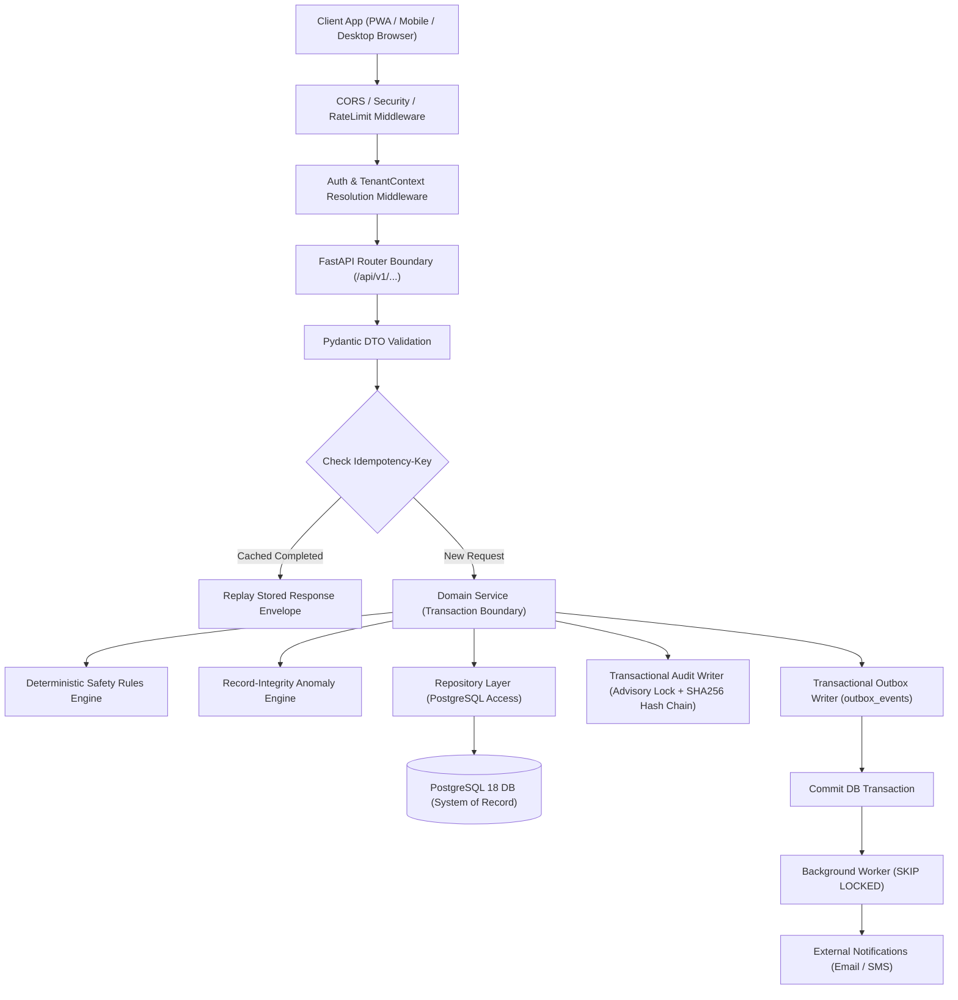

# Backend Architecture & Database Specifications (BACKEND_STRUCTURE.md) — Bharat FoodSafe

**App Name:** Bharat FoodSafe  
**Specification Version:** 1.5.0  
**Document Status:** Build-Locked Specification  
**Architecture Pattern:** Single Modular Monolith (FastAPI + SQLAlchemy 2.0 + PostgreSQL 18)  
**Tenant Scoping:** Mandatory `TenantContext` (`restaurant_id`) enforced at Service & Repository layers  

---

## 1. Architecture Overview



1. **Modular Monolith Pattern:** Domain features are organized inside isolated backend packages (`app/modules/<domain>/`) containing `model.py` (SQLAlchemy), `schema.py` (Pydantic), `repository.py` (DB access), `service.py` (Workflows & Transactions), `policies.py`, and `engine.py`.
2. **Authentication & Session Strategy:** Stateless short-lived JWT Access Tokens (15m TTL) + Persisted Refresh Sessions (7d TTL) stored as SHA-256 hashes in `auth_sessions`. Refresh token rotation revokes entire token family upon reuse detection.
3. **Data Flow & Transaction Boundaries:** Routers parse HTTP requests $\rightarrow$ Services execute business logic within explicit DB transactions $\rightarrow$ Writes append to `audit_log` and `outbox_events` before transaction commit.
4. **Idempotency Engine:** Mandatory `Idempotency-Key` headers for retryable write endpoints. `idempotency_keys` table holds `PROCESSING`, `COMPLETED`, or `FAILED` state to prevent duplicate operations.

---

## 2. Complete Database Schema (37 Tables)

All primary keys use `UUID` generated via `gen_random_uuid()`. Timestamps use `TIMESTAMPTZ` in UTC.

### 2.1 Core Identity & RBAC Tables

#### 1. `restaurants`
System tenant boundary entity.

| Column Name | Data Type | Constraints | Description |
| :--- | :--- | :--- | :--- |
| `id` | `UUID` | `PRIMARY KEY, DEFAULT gen_random_uuid()` | Unique tenant identifier |
| `name` | `VARCHAR(200)` | `NOT NULL` | Operating restaurant/brand name |
| `legal_name` | `VARCHAR(250)` | `NULL` | Registered legal business entity name |
| `category` | `VARCHAR(80)` | `NOT NULL` | Business category (e.g. RESTAURANT, CLOUD_KITCHEN) |
| `address_line1` | `VARCHAR(250)` | `NOT NULL` | Primary street address |
| `address_line2` | `VARCHAR(250)` | `NULL` | Secondary address info |
| `city` | `VARCHAR(100)` | `NOT NULL` | Operating city |
| `state` | `VARCHAR(100)` | `NOT NULL` | Operating state |
| `pincode` | `VARCHAR(10)` | `NOT NULL` | Postal PIN code |
| `phone` | `VARCHAR(20)` | `NULL` | Outlet contact phone number |
| `email` | `VARCHAR(255)` | `NULL` | Outlet contact email address |
| `timezone` | `VARCHAR(64)` | `NOT NULL, DEFAULT 'Asia/Kolkata'` | Operating timezone |
| `status` | `VARCHAR(20)` | `NOT NULL, CHECK (status IN ('ACTIVE','SUSPENDED','ARCHIVED'))` | Operational state |
| `created_at` | `TIMESTAMPTZ` | `NOT NULL, DEFAULT NOW()` | Record creation timestamp |
| `updated_at` | `TIMESTAMPTZ` | `NOT NULL, DEFAULT NOW()` | Record last updated timestamp |

#### 2. `users`
Accounts for staff, managers, platform admins, and customers.

| Column Name | Data Type | Constraints | Description |
| :--- | :--- | :--- | :--- |
| `id` | `UUID` | `PRIMARY KEY, DEFAULT gen_random_uuid()` | Unique user identifier |
| `restaurant_id` | `UUID` | `FOREIGN KEY (restaurants.id) ON DELETE RESTRICT, NULL` | Tenant assignment (NULL for Admin/Customer) |
| `name` | `VARCHAR(160)` | `NOT NULL` | Full name of user |
| `email` | `VARCHAR(255)` | `NULL` | Email address (unique where non-null) |
| `phone` | `VARCHAR(20)` | `NULL` | Mobile phone number (unique where non-null) |
| `password_hash` | `VARCHAR(255)` | `NULL` | Salted bcrypt password hash (Admin/Customer) |
| `pin_hash` | `VARCHAR(255)` | `NULL` | Salted bcrypt PIN hash (Staff/Manager) |
| `status` | `VARCHAR(20)` | `NOT NULL, CHECK (status IN ('INVITED','ACTIVE','SUSPENDED','DISABLED'))` | User account lifecycle state |
| `last_login_at` | `TIMESTAMPTZ` | `NULL` | Timestamp of last successful login |
| `created_at` | `TIMESTAMPTZ` | `NOT NULL, DEFAULT NOW()` | Record creation timestamp |
| `updated_at` | `TIMESTAMPTZ` | `NOT NULL, DEFAULT NOW()` | Record last updated timestamp |

*Indexes:* `uq_users_email` (`UNIQUE(lower(email)) WHERE email IS NOT NULL`), `uq_users_phone` (`UNIQUE(phone) WHERE phone IS NOT NULL`).

#### 3. `roles`
System and custom access roles.

| Column Name | Data Type | Constraints | Description |
| :--- | :--- | :--- | :--- |
| `id` | `UUID` | `PRIMARY KEY, DEFAULT gen_random_uuid()` | Role identifier |
| `name` | `VARCHAR(80)` | `UNIQUE, NOT NULL` | Role code (e.g. `STAFF`, `MANAGER`, `PLATFORM_ADMIN`) |
| `description` | `VARCHAR(255)` | `NULL` | Human readable role description |
| `is_system_role` | `BOOLEAN` | `NOT NULL, DEFAULT false` | Prevents deletion of system roles |
| `created_at` | `TIMESTAMPTZ` | `NOT NULL, DEFAULT NOW()` | Record creation timestamp |
| `updated_at` | `TIMESTAMPTZ` | `NOT NULL, DEFAULT NOW()` | Record last updated timestamp |

#### 4. `permissions`
Granular resource-action authorization definitions.

| Column Name | Data Type | Constraints | Description |
| :--- | :--- | :--- | :--- |
| `id` | `UUID` | `PRIMARY KEY, DEFAULT gen_random_uuid()` | Permission identifier |
| `resource` | `VARCHAR(80)` | `NOT NULL` | Resource group (e.g. `task`, `incident`, `rule`) |
| `action` | `VARCHAR(40)` | `NOT NULL` | Action allowed (e.g. `read`, `create`, `verify`) |
| `created_at` | `TIMESTAMPTZ` | `NOT NULL, DEFAULT NOW()` | Record creation timestamp |
| `updated_at` | `TIMESTAMPTZ` | `NOT NULL, DEFAULT NOW()` | Record last updated timestamp |

*Constraints:* `UNIQUE(resource, action)`.

#### 5. `role_permissions`
Junction table mapping permissions to roles.

| Column Name | Data Type | Constraints | Description |
| :--- | :--- | :--- | :--- |
| `id` | `UUID` | `PRIMARY KEY, DEFAULT gen_random_uuid()` | Mapping identifier |
| `role_id` | `UUID` | `FOREIGN KEY (roles.id) ON DELETE CASCADE, NOT NULL` | Target role |
| `permission_id`| `UUID` | `FOREIGN KEY (permissions.id) ON DELETE CASCADE, NOT NULL` | Target permission |
| `created_at` | `TIMESTAMPTZ` | `NOT NULL, DEFAULT NOW()` | Mapping created timestamp |
| `updated_at` | `TIMESTAMPTZ` | `NOT NULL, DEFAULT NOW()` | Mapping updated timestamp |

*Constraints:* `UNIQUE(role_id, permission_id)`.

#### 6. `user_roles`
Junction table assigning roles to users with historical revocation tracking.

| Column Name | Data Type | Constraints | Description |
| :--- | :--- | :--- | :--- |
| `id` | `UUID` | `PRIMARY KEY, DEFAULT gen_random_uuid()` | Assignment identifier |
| `user_id` | `UUID` | `FOREIGN KEY (users.id) ON DELETE RESTRICT, NOT NULL` | Target user |
| `role_id` | `UUID` | `FOREIGN KEY (roles.id) ON DELETE RESTRICT, NOT NULL` | Assigned role |
| `restaurant_id` | `UUID` | `FOREIGN KEY (restaurants.id) ON DELETE RESTRICT, NULL` | Restaurant scope for role assignment |
| `assigned_by` | `UUID` | `FOREIGN KEY (users.id) ON DELETE SET NULL, NULL` | User who authorized assignment |
| `assigned_at` | `TIMESTAMPTZ` | `NOT NULL, DEFAULT NOW()` | Assignment timestamp |
| `revoked_at` | `TIMESTAMPTZ` | `NULL` | Historical revocation timestamp (soft revoke) |
| `created_at` | `TIMESTAMPTZ` | `NOT NULL, DEFAULT NOW()` | Record creation timestamp |
| `updated_at` | `TIMESTAMPTZ` | `NOT NULL, DEFAULT NOW()` | Record last updated timestamp |

#### 7. `devices`
User device registration and risk signal metadata.

| Column Name | Data Type | Constraints | Description |
| :--- | :--- | :--- | :--- |
| `id` | `UUID` | `PRIMARY KEY, DEFAULT gen_random_uuid()` | Device identifier |
| `user_id` | `UUID` | `FOREIGN KEY (users.id) ON DELETE RESTRICT, NOT NULL` | Device owner |
| `restaurant_id` | `UUID` | `FOREIGN KEY (restaurants.id) ON DELETE RESTRICT, NOT NULL` | Outlet scope |
| `device_identifier_hash` | `VARCHAR(128)` | `NOT NULL` | SHA-256 fingerprint hash of client device |
| `name` | `VARCHAR(120)` | `NULL` | Device label (e.g. Kitchen Tablet 1) |
| `platform` | `VARCHAR(40)` | `NOT NULL` | Platform (e.g. ANDROID, IOS, WEB) |
| `last_seen_at` | `TIMESTAMPTZ` | `NULL` | Last active device timestamp |
| `is_active` | `BOOLEAN` | `NOT NULL, DEFAULT true` | Device authorization state |
| `created_at` | `TIMESTAMPTZ` | `NOT NULL, DEFAULT NOW()` | Record creation timestamp |
| `updated_at` | `TIMESTAMPTZ` | `NOT NULL, DEFAULT NOW()` | Record last updated timestamp |

#### 8. `auth_sessions`
Persisted refresh token session records supporting token family rotation.

| Column Name | Data Type | Constraints | Description |
| :--- | :--- | :--- | :--- |
| `id` | `UUID` | `PRIMARY KEY, DEFAULT gen_random_uuid()` | Session identifier |
| `user_id` | `UUID` | `FOREIGN KEY (users.id) ON DELETE CASCADE, NOT NULL` | Session owner |
| `refresh_token_hash`| `VARCHAR(255)`| `UNIQUE, NOT NULL` | SHA-256 hash of refresh token |
| `token_family_id` | `UUID` | `NOT NULL` | Family ID for reuse detection |
| `device_id` | `UUID` | `FOREIGN KEY (devices.id) ON DELETE SET NULL, NULL` | Associated device |
| `issued_at` | `TIMESTAMPTZ` | `NOT NULL` | Token issue timestamp |
| `expires_at` | `TIMESTAMPTZ` | `NOT NULL` | Hard session expiry timestamp |
| `revoked_at` | `TIMESTAMPTZ` | `NULL` | Session revocation timestamp |
| `last_used_at` | `TIMESTAMPTZ` | `NULL` | Last token refresh timestamp |
| `replaced_by_session_id`| `UUID` | `FOREIGN KEY (auth_sessions.id) ON DELETE SET NULL, NULL` | Successor session in rotation chain |
| `created_at` | `TIMESTAMPTZ` | `NOT NULL, DEFAULT NOW()` | Record creation timestamp |
| `updated_at` | `TIMESTAMPTZ` | `NOT NULL, DEFAULT NOW()` | Record last updated timestamp |

---

### 2.2 Domain Tables (Tasks, Entries, Evidence, Rules, Incidents)

#### 9. `task_categories` — Categorization for tasks (`Temperature`, `Hygiene`, `Receiving`).
#### 10. `rule_sources` — Regulatory document sources (FSSAI guidelines, internal SOPs). Requires status `VERIFIED` to activate safety rules.
#### 11. `safety_rules` — Versioned deterministic safety rules (`supersedes_rule_id`, `rule_code`, `version_number`, `condition_jsonb`, `action_jsonb`).
#### 12. `safety_rule_bindings` — Binding map between rules and categories or templates.
#### 13. `task_templates` — Task template metadata (`restaurant_id`, `category_id`, `name`).
#### 14. `task_template_versions` — Immutable versioned task execution requirements (`configuration_jsonb`).
#### 15. `equipment` — Physical kitchen equipment entity (`name`, `equipment_type`, `location`, `status`).
#### 16. `tasks` — Scheduled task occurrences (`template_id`, `template_version_id`, `occurrence_key`, `status`, `due_at`).
#### 17. `task_assignments` — Assignment history mapping tasks to staff members.
#### 18. `entries` — Executed task records (`value_numeric`, `value_text`, `value_jsonb`, `unit`, `safety_status`, `idempotency_key_id`).
#### 19. `entry_safety_evaluations` — Immutable historical evaluation snapshots referencing exact rule and source versions.
#### 20. `evidence_files` — Object storage evidence metadata (`storage_key`, `original_filename`, `mime_type`, `size_bytes`, `sha256`, `upload_status`).
#### 21. `idempotency_keys` — Prevents duplicate business mutations (`key`, `request_hash`, `status`, `response_jsonb`).
#### 22. `model_versions` — Frozen ML Isolation Forest model metadata and threshold config.
#### 23. `anomaly_results` — Statistical record-integrity evaluation outputs (`baseline_score`, `ml_score`, `decision`, `reasons_jsonb`).
#### 24. `incidents` — Food safety exception incidents (`entry_id`, `severity`, `status`, `detected_by`).
#### 25. `corrective_actions` — CAPA workflow resolution records (`incident_id`, `assigned_to`, `status`, `verified_by`).
#### 26. `suppliers` — Supplier master records.
#### 27. `products` — Product master records.
#### 28. `batches` — Received inventory batch traceability records (`batch_no`, `expiry_date`, `status`).
#### 29. `business_verifications` — Restaurant verification documents and approval state.
#### 30. `verification_documents` — Verification document links to `evidence_files` with OCR fields.
#### 31. `notifications` — In-app user notifications.
#### 32. `notification_preferences` — User channel preferences per event type.
#### 33. `outbox_events` — Transactional event outbox for async delivery workers (`SKIP LOCKED`).
#### 34. `audit_log` — Append-only audit log with SHA-256 hash chaining (`previous_hash`, `record_hash`).
#### 35. `public_profile_settings` — Public transparency profile toggles.
#### 36. `customer_follows` — Customer outlet bookmark/follow table.
#### 37. `official_records` — Verified external government ratings and official records.

---

## 3. Canonical API Envelope & Endpoint Matrix

All application endpoints return responses wrapped in standardized JSON envelopes.

### Success Response Envelope:
```json
{
  "success": true,
  "data": {
    "id": "9b1deb4d-3b7d-4bad-9bdd-2b0d7b3dcb6d",
    "name": "Walk-In Chiller #1",
    "status": "ACTIVE"
  },
  "meta": {
    "request_id": "c7a8b9d0-1234-5678-9abc-def012345678",
    "pagination": null
  }
}
```

### Error Response Envelope:
```json
{
  "success": false,
  "error": {
    "code": "ENTRY_EVIDENCE_REQUIRED",
    "message": "Photo evidence is required for this temperature check.",
    "details": [
      {
        "field": "evidence_file_id",
        "issue": "Field cannot be null for tasks requiring physical photo verification."
      }
    ]
  },
  "meta": {
    "request_id": "c7a8b9d0-1234-5678-9abc-def012345678"
  }
}
```

---

### 3.1 Authentication Endpoints (`/api/v1/auth/*`)

#### 1. `POST /api/v1/auth/login`
- **Auth Required:** No (Public)
- **Request Body:**
  ```json
  {
    "phone": "9876543210",
    "pin": "1234"
  }
  ```
- **Validation:** `phone` must be 10 digits; `pin` must be 4-6 digits.
- **Response (200 OK):**
  ```json
  {
    "success": true,
    "data": {
      "access_token": "eyJhbGciOiJIUzI1Ni...",
      "token_type": "bearer",
      "expires_in_seconds": 900,
      "user": {
        "id": "11111111-1111-1111-1111-111111111111",
        "name": "Rajesh Kumar",
        "restaurant_id": "22222222-2222-2222-2222-222222222222",
        "roles": ["STAFF"]
      }
    },
    "meta": { "request_id": "req_01" }
  }
}
  ```
- **Error Cases:** `401 INVALID_CREDENTIALS`, `403 ACCOUNT_SUSPENDED`, `429 RATE_LIMIT_EXCEEDED`.

#### 2. `POST /api/v1/auth/refresh`
- **Auth Required:** Yes (Valid Refresh Token in Cookie/Header)
- **Response (200 OK):** Issues new Access Token and rotated Refresh Token.
- **Error Cases:** `401 INVALID_REFRESH_TOKEN`, `401 TOKEN_FAMILY_REVOKED`.

---

### 3.2 Task & Entry Endpoints (`/api/v1/tasks/*` & `/api/v1/entries/*`)

#### 3. `POST /api/v1/tasks/{id}/entries`
- **Auth Required:** Yes (`Staff` or `Manager` assigned to tenant)
- **Headers:** `Authorization: Bearer <token>`, `Idempotency-Key: <uuid>`
- **Request Body:**
  ```json
  {
    "value_numeric": 3.5,
    "value_text": null,
    "value_jsonb": null,
    "unit": "C",
    "equipment_id": "33333333-3333-3333-3333-333333333333",
    "evidence_file_id": "44444444-4444-4444-4444-444444444444"
  }
  ```
- **Side Effects:**
  - Evaluates deterministic Safety Rules Engine $\rightarrow$ writes `entry_safety_evaluations`.
  - Runs Anomaly Engine $\rightarrow$ writes `anomaly_results`.
  - If `CRITICAL`, creates `incidents` and `corrective_actions` rows $\rightarrow$ writes `outbox_events` notification.
  - Appends SHA-256 audit row to `audit_log` using advisory lock.
- **Response (201 Created):**
  ```json
  {
    "success": true,
    "data": {
      "entry_id": "55555555-5555-5555-5555-555555555555",
      "task_id": "66666666-6666-6666-6666-666666666666",
      "safety_status": "NORMAL",
      "trust_level": "EVIDENCE_SUPPORTED",
      "anomaly": {
        "decision": "NO_FLAG",
        "risk_level": "LOW",
        "reasons": []
      }
    },
    "meta": { "request_id": "req_02" }
  }
  ```
- **Error Cases:** `400 INVALID_TASK_STATE`, `404 TASK_NOT_FOUND`, `409 IDEMPOTENCY_KEY_REUSE`, `422 EVIDENCE_REQUIRED`.

---

## 4. JWT & Password Security Specifications

- **Access Token:** Algorithm `HS256`, 15-Minute Expiry ($900\text{ s}$). Payload contains `sub` (User ID), `tenant_id` (Restaurant ID), `roles` (Array of role codes), `exp`, `iat`, and `jti`.
- **Refresh Token:** Algorithm `HS256`, 7-Day Expiry ($604,800\text{ s}$). Payload contains `sub`, `family_id`, `session_id`, `exp`. Stored in DB strictly as `SHA256(token)`.
- **Password & PIN Security:** Salted `bcrypt` hash generated using `Passlib` with `rounds=12`. Plaintext passwords/PINs are never saved or logged.

---

## 5. Rate Limiting & Optimization Strategy

| Endpoint Group | Maximum Rate Limit | Window | Action on Violation |
| :--- | :--- | :--- | :--- |
| **Authentication (`/auth/login`)** | 5 Attempts | 60 Seconds | HTTP 429 Too Many Requests |
| **Upload Presign (`/uploads/presign`)** | 20 Requests | 60 Seconds | HTTP 429 Too Many Requests |
| **General Transactional Write APIs** | 60 Requests | 60 Seconds | HTTP 429 Too Many Requests |
| **Read Queries & Dashboards** | 120 Requests | 60 Seconds | HTTP 429 Too Many Requests |

---

## 6. Database Migration Strategy (Alembic)

1. **Tool:** `Alembic 1.14.0` managing SQLAlchemy ORM metadata migrations in `backend/migrations/`.
2. **Migration Command:** `alembic upgrade head` executes automatically during deployment CI/CD.
3. **Rollback Safety:** Every migration script must include a tested `downgrade()` function. Destructive `DROP TABLE` or `DROP COLUMN` commands are strictly forbidden in production without prior backup snapshot and multi-stage deprecation releases.
