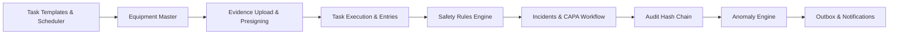

# Master Implementation Plan (IMPLEMENTATION_PLAN.md) — Bharat FoodSafe

**App Name:** Bharat FoodSafe  
**Specification Version:** 1.5.0  
**Document Status:** Build-Locked Implementation Blueprint  
**Architecture Pattern:** Single Modular Monolith (FastAPI + React 19 + PostgreSQL 18)  
**Cross-References:** [`PRD_Bharat_FoodSafe.md`](./PRD_Bharat_FoodSafe.md), [`APP_FLOW.md`](./APP_FLOW.md), [`TECH_STACK.md`](./TECH_STACK.md), [`FRONTEND_GUIDELINES.md`](./FRONTEND_GUIDELINES.md), [`BACKEND_STRUCTURE.md`](./BACKEND_STRUCTURE.md)

---

## 1. Overview & Build Philosophy

### 1.1 Project Overview
**Bharat FoodSafe** is an operational food safety assurance platform for commercial Indian kitchens. The platform converts food safety guidelines (FSSAI/SOPs) into versioned recurring tasks, captures physical photo/numerical evidence, executes deterministic safety evaluations, flags statistical record-integrity anomalies using machine learning (`scikit-learn`), tracks incidents and CAPA, and guarantees audit trail immutability using an append-only cryptographic hash chain.

### 1.2 Core Build Philosophy
1. **Contract-First & Test-Driven:** No feature enters implementation without pre-defined typed DTO schemas, validated API contracts, and explicit unit/integration test cases.
2. **Strict Modular Monolith Discipline:** Code is partitioned by domain module inside `backend/app/modules/`. Cross-domain access is restricted to formal service interfaces. Direct cross-module SQL queries are forbidden.
3. **Sequential Dependency Progression:** Each build phase builds directly upon verified components from previous steps. Zero parallel code is written without a solid database and auth foundation.

---

## 2. Phase 1: Project Setup & Infrastructure Bootstrap

### Step 1.1: Project Directory & Repository Initialization
- **Duration:** Day 1 (Morning)
- **Goal:** Establish canonical folder structure and version-control repositories.
- **Reference:** [`TECH_STACK.md`](./TECH_STACK.md) Section 4 & [`BACKEND_STRUCTURE.md`](./BACKEND_STRUCTURE.md) Section 1.

#### Task List:
1. Create canonical folder hierarchy:
   ```bash
   mkdir -p backend/app/core backend/app/api/v1 backend/app/modules backend/app/jobs backend/migrations backend/tests
   mkdir -p frontend/src/app frontend/src/features frontend/src/components/ui frontend/src/layouts frontend/src/services/api
   mkdir -p ml/data ml/models database/seeds docs
   ```
2. Initialize backend Python 3.13 virtual environment:
   ```bash
   cd backend
   py -3.13 -m venv .venv
   # Windows:
   .venv\Scripts\activate
   python -m pip install --upgrade pip
   ```
3. Create `requirements.txt` with locked dependencies from [`TECH_STACK.md`](./TECH_STACK.md) Section 5.2 and install:
   ```bash
   pip install -r requirements.txt
   ```
4. Initialize frontend Vite 6 + React 19 project:
   ```bash
   cd ../frontend
   npm init -y
   npm install react@19.2.0 react-dom@19.2.0 @tanstack/react-query@5.62.7 react-router-dom@7.1.1 axios@1.7.9 react-hook-form@7.54.2 zod@3.24.1 lucide-react@0.469.0 clsx@2.1.1 tailwind-merge@2.6.0
   npm install -D vite@6.0.7 typescript@5.7.2 tailwindcss@4.0.0 postcss@8.4.49 autoprefixer@10.4.20 vitest@2.1.8 @types/react@19.0.2 @types/node@22.10.2
   ```

#### Success Checklist:
- [ ] Backend virtual environment active with Python 3.13.1.
- [ ] `pip list` matches exact pinned packages from [`TECH_STACK.md`](./TECH_STACK.md).
- [ ] Frontend `npm run dev` launches local Vite development server without errors.

---

### Step 1.2: Environment Configuration Setup
- **Duration:** Day 1 (Afternoon)
- **Goal:** Configure development environment secrets and application settings.
- **Reference:** [`TECH_STACK.md`](./TECH_STACK.md) Section 3.

#### Task List:
1. Create `backend/.env.example` and copy to `backend/.env` with local PostgreSQL 18 credentials, JWT secrets, and S3 mock options.
2. Create `frontend/.env.example` and copy to `frontend/.env` configuring `VITE_API_BASE_URL=http://localhost:8000/api/v1`.
3. Implement `backend/app/core/config.py` using `pydantic-settings` to parse environment settings safely.

#### Success Checklist:
- [ ] Pydantic settings parser loads all variables without validation errors.
- [ ] Secrets and credentials ignored by `.gitignore`.

---

### Step 1.3: Database Schema Migration & Seed Initialization
- **Duration:** Days 2–3
- **Goal:** Initialize PostgreSQL 18 database and apply the 37-table migration schema.
- **Reference:** [`BACKEND_STRUCTURE.md`](./BACKEND_STRUCTURE.md) Section 2.

#### Task List:
1. Create local PostgreSQL database: `bharat_foodsafe`.
2. Initialize Alembic migration scripts:
   ```bash
   cd backend
   alembic init migrations
   ```
3. Configure `migrations/env.py` to import SQLAlchemy models.
4. Generate initial migration script for all 37 tables defined in [`BACKEND_STRUCTURE.md`](./BACKEND_STRUCTURE.md) Section 2.
5. Apply database migration:
   ```bash
   alembic upgrade head
   ```
6. Create seed script `database/seeds/run_all.py` inserting system roles (`STAFF`, `MANAGER`, `PLATFORM_ADMIN`), base permissions, and demo restaurant tenant.

#### Success Checklist:
- [ ] `alembic upgrade head` completes cleanly with 0 SQL syntax errors.
- [ ] PostgreSQL table inventory confirms 37 tables with foreign keys and unique constraints.
- [ ] System roles and demo tenant successfully populated by seed scripts.

---

## 3. Phase 2: Design System & Shared Frontend Foundations

### Step 2.1: Design Tokens & Tailwind CSS Configuration
- **Duration:** Day 4
- **Goal:** Configure Tailwind CSS 4 and global design tokens.
- **Reference:** [`FRONTEND_GUIDELINES.md`](./FRONTEND_GUIDELINES.md) Section 2.

#### Task List:
1. Configure `frontend/src/styles/globals.css` with CSS custom properties for Emerald primary (`#10b981`), Slate neutral (`#0f172a`), and semantic status colors (`NORMAL`, `DEVIATION`, `CRITICAL`).
2. Verify Inter font import in `index.html`.

---

### Step 2.2: Reusable Component Library Implementation
- **Duration:** Days 5–6
- **Goal:** Build and verify basic UI components.
- **Reference:** [`FRONTEND_GUIDELINES.md`](./FRONTEND_GUIDELINES.md) Section 3.

#### Task List:
1. Implement `Button.tsx` supporting variants (`primary`, `secondary`, `danger`, `outline`, `ghost`) and loading state.
2. Implement `Input.tsx` with error handling (`aria-invalid`) and label association.
3. Implement `Card.tsx`, `Modal.tsx`, `Alert.tsx`, `Skeleton.tsx`, and `EmptyState.tsx`.
4. Create Vitest unit tests in `frontend/src/components/ui/__tests__/` to verify states and accessibility parameters.

#### Success Checklist:
- [ ] All 7 core UI components pass unit tests in Vitest (`npm run test`).
- [ ] Focus indicators (`ring-2 ring-emerald-500`) display correctly on keyboard navigation.

---

## 4. Phase 3: Authentication & Multi-Tenant RBAC

### Step 3.1: Backend Auth Service & Session Management
- **Duration:** Days 7–8
- **Goal:** Build authentication endpoints, password/PIN hashing, and tenant isolation middleware.
- **Reference:** [`BACKEND_STRUCTURE.md`](./BACKEND_STRUCTURE.md) Sections 2.1, 3.1, 4 & [`PRD_Bharat_FoodSafe.md`](./PRD_Bharat_FoodSafe.md) Feature 1.

#### Task List:
1. Implement `passlib` bcrypt hashing utility (12 rounds) for PINs and passwords.
2. Implement JWT token generator (15m access token, 7d refresh session).
3. Implement `auth_sessions` table repository supporting token family rotation and reuse revocation.
4. Implement FastAPI router `/api/v1/auth/login`, `/api/v1/auth/refresh`, `/api/v1/auth/logout`, and `/api/v1/auth/me`.
5. Implement `TenantContext` dependency in `backend/app/core/tenant.py` enforcing `restaurant_id` isolation.

#### Success Checklist:
- [ ] `/auth/login` issues valid JWT access token and sets refresh cookie.
- [ ] Attempted refresh token reuse revokes entire token family and returns `401`.
- [ ] Cross-tenant API queries return `403 Forbidden` or `404 Not Found`.

---

### Step 3.2: Frontend Auth Flow & Axios Refresh Interceptor
- **Duration:** Day 9
- **Goal:** Create frontend login pages and automatic token refresh interceptor.
- **Reference:** [`APP_FLOW.md`](./APP_FLOW.md) Flow 1.

#### Task List:
1. Build `LoginPage.tsx` supporting Phone + PIN (Staff/Manager) and Email + Password (Admin).
2. Configure Axios instance in `frontend/src/services/api/client.ts` with response interceptors to catch `401` errors and attempt background token refresh via `/auth/refresh`.
3. Implement `ProtectedRoute.tsx` wrapper checking role permissions against current session state.

#### Success Checklist:
- [ ] Staff user logs in and redirects to `/staff/dashboard`.
- [ ] Expired access token triggers invisible background refresh without logging user out.

---

## 5. Phase 4: Core Features (P0 Feature Development)



### Step 4.1: Task Templates & Immutable Versioning
- **Duration:** Days 10–11
- **Goal:** Implement versioned task templates and categories.
- **Reference:** [`PRD_Bharat_FoodSafe.md`](./PRD_Bharat_FoodSafe.md) Feature 2 & [`BACKEND_STRUCTURE.md`](./BACKEND_STRUCTURE.md).

#### Execution:
1. **Backend:** Implement `task_categories`, `task_templates`, and `task_template_versions` repositories and services. Enforce configuration immutability after first task generation.
2. **Frontend:** Build Manager template management screen (`/admin/task-templates`).
3. **Integration & Test:** Write Pytest unit tests ensuring updating a template creates a new version row (`version_number + 1`).

---

### Step 4.2: Equipment Master Module
- **Duration:** Day 12
- **Goal:** Implement domain management of physical kitchen equipment.
- **Reference:** [`PRD_Bharat_FoodSafe.md`](./PRD_Bharat_FoodSafe.md) Feature 9.

#### Execution:
1. **Backend:** Build `equipment` CRUD endpoints (`/api/v1/equipment`).
2. **Frontend:** Build Manager equipment view (`/manager/equipment`).
3. **Integration & Test:** Verify equipment binding to task occurrences.

---

### Step 4.3: Task Scheduler & Occurrence Idempotency
- **Duration:** Day 13
- **Goal:** Build idempotent background scheduler generating daily recurring tasks.
- **Reference:** [`PRD_Bharat_FoodSafe.md`](./PRD_Bharat_FoodSafe.md) Feature 2.

#### Execution:
1. **Backend:** Implement task generation background job (`backend/app/jobs/generate_tasks.py`). Enforce database `UNIQUE(template_id, occurrence_key)` constraint.
2. **Integration & Test:** Execute job twice in test runner and verify zero duplicate task instances created.

---

### Step 4.4: Presigned Evidence Upload & Binary Validation
- **Duration:** Days 14–15
- **Goal:** Secure object storage evidence submission pipeline.
- **Reference:** [`PRD_Bharat_FoodSafe.md`](./PRD_Bharat_FoodSafe.md) Feature 3 & [`APP_FLOW.md`](./APP_FLOW.md) Flow 2.

#### Execution:
1. **Backend:** Implement `/api/v1/uploads/presign` and `/api/v1/uploads/{id}/confirm`. Inspect magic bytes (JPEG/PNG/WebP), size (10MB max), and compute SHA-256.
2. **Frontend:** Implement `EvidenceUploader.tsx` component with camera capture and upload progress.
3. **Integration & Test:** Verify non-image files are rejected with HTTP `400/422`.

---

### Step 4.5: Staff Task Execution & Persistent Idempotency
- **Duration:** Days 16–17
- **Goal:** Complete staff task execution workflow with `Idempotency-Key` protection.
- **Reference:** [`PRD_Bharat_FoodSafe.md`](./PRD_Bharat_FoodSafe.md) Feature 3 & [`APP_FLOW.md`](./APP_FLOW.md) Flow 2.

#### Execution:
1. **Backend:** Implement `POST /api/v1/tasks/{id}/entries` incorporating `idempotency_keys` processing/replay check.
2. **Frontend:** Build `/staff/tasks/:id` task execution form.
3. **Integration & Test:** Re-send exact same payload twice with same key; verify identical response replayed without duplicate DB entry.

---

### Step 4.6: Deterministic Safety Rules Engine
- **Duration:** Days 18–19
- **Goal:** Build rule engine evaluating numerical values against verified regulatory sources.
- **Reference:** [`PRD_Bharat_FoodSafe.md`](./PRD_Bharat_FoodSafe.md) Feature 4 & [`BACKEND_STRUCTURE.md`](./BACKEND_STRUCTURE.md).

#### Execution:
1. **Backend:** Implement `backend/app/modules/safety_rules/engine.py`. Enforce rule activation gate (`RuleSource.review_status == 'VERIFIED'`). Write immutable `entry_safety_evaluations` snapshot upon entry evaluation.
2. **Frontend:** Add safety status badges (`NORMAL`, `DEVIATION`, `CRITICAL`) to staff and manager views.
3. **Integration & Test:** Verify entry with out-of-range value returns `CRITICAL` status in $< 50\text{ ms}$.

---

### Step 4.7: Incidents & CAPA Resolution Workflow
- **Duration:** Days 20–21
- **Goal:** Build automated incident management and CAPA verification lifecycle.
- **Reference:** [`PRD_Bharat_FoodSafe.md`](./PRD_Bharat_FoodSafe.md) Feature 5 & [`APP_FLOW.md`](./APP_FLOW.md) Flow 3.

#### Execution:
1. **Backend:** Implement state machine endpoints for `incidents` and `corrective_actions`. Prohibit generic status `PATCH`. Require re-check entry to close CAPA.
2. **Frontend:** Build Manager Incident Queue (`/manager/incidents`) and CAPA verification panel.
3. **Integration & Test:** Verify `CRITICAL` safety entry automatically instantiates `OPEN` incident and CAPA.

---

### Step 4.8: Append-Only Cryptographic Audit Hash Chain
- **Duration:** Days 22–23
- **Goal:** Implement audit log with transaction-level advisory locks and SHA-256 hash chaining.
- **Reference:** [`PRD_Bharat_FoodSafe.md`](./PRD_Bharat_FoodSafe.md) Feature 6 & [`BACKEND_STRUCTURE.md`](./BACKEND_STRUCTURE.md).

#### Execution:
1. **Backend:** Implement `backend/app/core/audit.py`. Acquire `pg_advisory_xact_lock(chain_scope)` before calculating `record_hash = SHA256(event + previous_hash)`.
2. **Frontend:** Build Audit Log viewer (`/manager/audit`).
3. **Integration & Test:** Run multi-threaded concurrent write test script; verify zero broken audit chain links.

---

### Step 4.9: Record-Integrity Anomaly Engine
- **Duration:** Days 24–25
- **Goal:** Deploy scikit-learn Isolation Forest model for statistical anomaly review.
- **Reference:** [`PRD_Bharat_FoodSafe.md`](./PRD_Bharat_FoodSafe.md) Feature 7 & [`APP_FLOW.md`](./APP_FLOW.md) Flow 4.

#### Execution:
1. **Backend/ML:** Implement feature extractor (`burst_score`, `timing_regularity`, `value_variance`) and inference runner (`backend/app/modules/anomaly/inference.py`). Set fallback `analysis_status = UNAVAILABLE` if entry history $< 30$.
2. **Frontend:** Build Manager Anomaly Review Queue (`/manager/anomalies`).
3. **Integration & Test:** Verify artificial burst submission flags `REVIEW` without overriding deterministic safety results.

---

### Step 4.10: Transactional Outbox & Notification Worker
- **Duration:** Day 26
- **Goal:** Asynchronous outbox delivery worker.
- **Reference:** [`PRD_Bharat_FoodSafe.md`](./PRD_Bharat_FoodSafe.md) Feature 8.

#### Execution:
1. **Backend:** Implement `outbox_events` transactional writer and background worker using `SELECT ... FOR UPDATE SKIP LOCKED` with lease recovery.
2. **Integration & Test:** Verify worker recovers crashed leases and delivers deduped notifications.

---

## 6. Phase 5: Comprehensive Testing & Quality Assurance

### Step 5.1: Backend & Frontend Test Automation Suite
- **Duration:** Days 27–28
- **Goal:** Achieve target code coverage and run end-to-end integration tests.

```bash
# Run Backend Pytest Suite with Coverage
cd backend
pytest --cov=app tests/ --cov-fail-under=85

# Run Frontend Vitest Suite
cd ../frontend
npm run test

# Run Playwright E2E Tests
npm run e2e
```

#### Coverage Targets:
- Backend Services & Core Engine: $\ge 85\%$ line coverage.
- Deterministic Safety Rules Engine: $100\%$ logic branch coverage.
- Frontend Core UI Components & Utilities: $\ge 80\%$ coverage.

---

## 7. Phase 6: Production Deployment & Release Gates

### Step 6.1: Deployment Rehearsal & Verification
- **Duration:** Days 29–30
- **Goal:** Execute production migration rehearsal, seed verified rule sources, and launch application.

#### Release Gate Verification Checklist:
- [ ] **FSSAI Rule Source Verification:** All active safety rules linked to a `VERIFIED` `RuleSource`.
- [ ] **Automated CI Validation:** GitHub Actions CI build passes for both Python 3.13 and Node.js 22.
- [ ] **Database Migration Rehearsal:** `alembic upgrade head` executed against clean staging DB without error.
- [ ] **Security Audit:** Automated IDOR cross-tenant test suite passes with 0 leaks.
- [ ] **Audit Chain Validation:** Automated hash verification confirms 0 broken links in `audit_log`.

---

## 8. Project Risk & Mitigation Matrix

| Identified Risk | Severity | Impact Area | Mitigation Strategy |
| :--- | :--- | :--- | :--- |
| **Cross-Tenant Data Leak (IDOR)** | **CRITICAL** | Data Privacy & Security | Mandatory `TenantContext` middleware injected into repository queries; automated IDOR security test suite in CI. |
| **Duplicate Task Submissions on Mobile Network Drops** | **HIGH** | Operational Record Integrity | Client sends unique `Idempotency-Key` header; server caches and replays original response without duplicate write. |
| **Audit Log Hash Chain Concurrency Break** | **HIGH** | Compliance Auditability | Server acquires PostgreSQL transaction advisory lock (`pg_advisory_xact_lock`) before computing previous hash. |
| **ML Anomaly Model Service Timeout** | **MEDIUM** | System Reliability | Anomaly analysis wrapped in fallback handler; sets `analysis_status = UNAVAILABLE` without blocking deterministic safety rules. |
| **Unverified Rule Source Activation** | **HIGH** | Regulatory Integrity | Server enforces strict rule activation check (`RuleSource.review_status == 'VERIFIED'`); unverified rules cannot affect task execution. |
